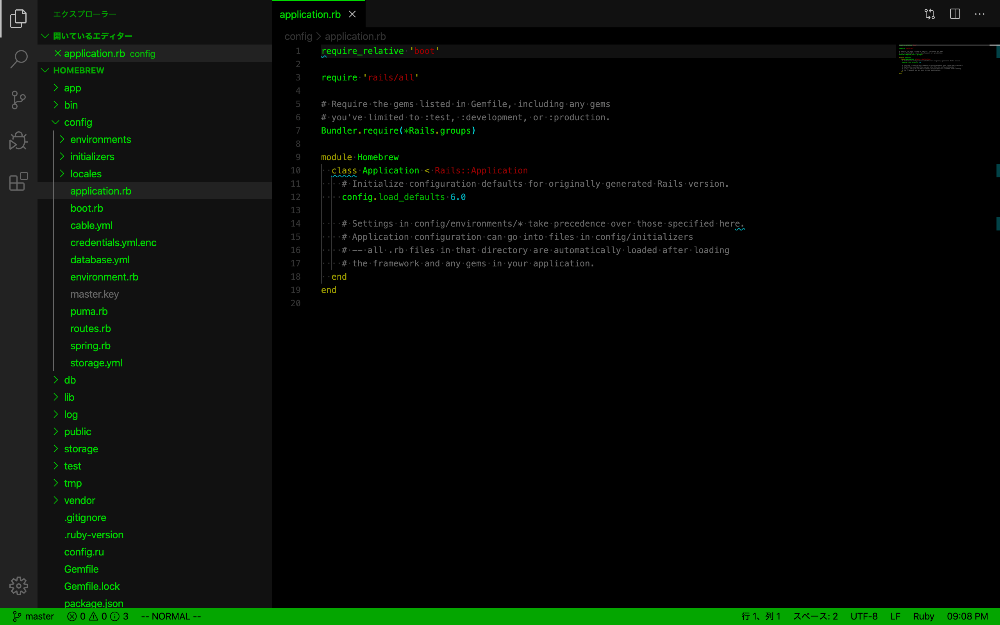

# vscode-theme-homebrew

Terminal.app's Homebrew theme for Visual Studio Code.

## Screenshot

## Color scheme

|Color|Code|Color|Code|
|-|-|-|-|
| Black|`#000`| Bright Black|`#666`|
| Blue|`#0000b2`| Bright Blue|`#00f`|
| Cyan|`#00a6b2`| Bright Cyan|`#00e5e5`|
| Green|`#00a600`| Bright Green|`#00d900`|
| Magenta|`#b200b2`| Bright Magenta|`#e500e5`|
| Red|`#900`| Bright Red|`#e50000`|
| White|`#bfbfbf`| Bright White|`#e5e5e5`|
| Yellow|`#990`| Bright Yellow|`#e5e500`|

## Contributing

Bug reports and pull requests are welcome on GitHub at https://github.com/zenizh/vscode-theme-homebrew.

## License

The extension is available as open source under the terms of the [MIT License](https://opensource.org/licenses/MIT).
